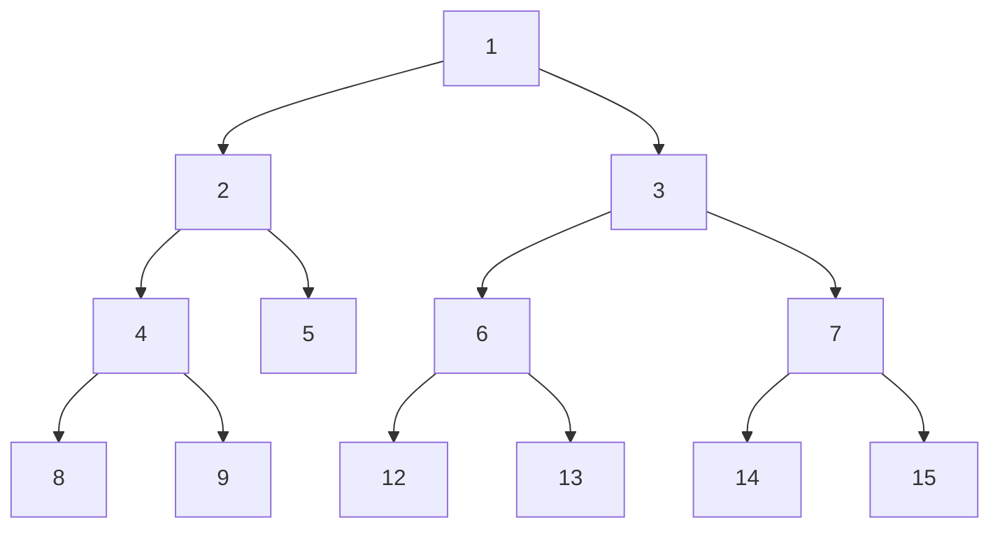

# 树

# Binary Tree

二叉树 ( binary tree ) 是一种非线性的数据结构，代表 " 祖先 " 和 " 后代 " 之间的派生关系，体现一分为二的分治逻辑

二叉树的基本单元都是节点，每个节点包括值、**左子节点 ( left-child node )** 和 **右子节点 ( right-child node )**，该节点被称为两个子节点的 **父节点 ( parent node )**，将该节点的左子结点及其以下节点称为该节点的 **左子树 ( left subtree )** ，同理右侧称**右子树 ( right subtree )**



**除了叶节点外，其他所有节点都包括子节点和非空子树**

**术语**：

- **根节点 ( root node )**：二叉树顶层的节点，没有父节点
- **叶节点 ( left node )**：没有子节点的节点，两个指针都指向 `None`
- **边 ( edge )**：连接连个节点的线段，即节点引用 ( 指针 )
- 节点所在的**层 ( level )**：从顶至底递增，根节点所在的层为 1
- 节点的 **度 ( degree )**：节点的子节点数量，在二叉树中，度的取值范围是 0、1、2
- 二叉树的 **高度 ( height )**：从根节点到最远叶节点所经过的边的数量
- 节点的 **深度 ( depth )**：从根节点到该节点所经过的边的数量
- 节点的 **高度 ( height )**：从距离该节点的最远叶节点到该节点所经过的边的数量

二叉树的类型：

1. **完美二叉树 ( perfect binary tree )**：所有层的节点被完全填满。完美二叉树中，叶节点的度都为 0，其余节点的度为 2；若树的高度为 h，则节点总数为 `2^(h+1) -1`

   ```mermaid
   graph TD;
   	1 --> 2;
   	1 --> 3;
   	2 --> 4;
   	2 --> 5;
   	3 --> 6;
   	3 --> 7;
   	4 --> 8;
   	4 --> 9;
   	5-->10;
   	5-->11;
   	6 --> 12;
   	6 --> 13;
   	7 --> 14;
   	7 --> 15;
   ```

   > 完美二叉树，又称为 **满二叉树**

2. **完全二叉树 ( complete binary tree ) **：只有最底层未被填满，且最底层节点尽量靠左填充

   ```mermaid
   graph TD;
   	1 --> 2;
   	1 --> 3;
   	2 --> 4;
   	2 --> 5;
   	3 --> 6;
   	3 --> 7;
   	4 --> 8;
   	4 --> 9;
   	5-->10;
   	5-->11;
   	6 --> 12;
   	
   ```

3. 完满二叉树 ( full binary tree )：除了叶节点之外，其余所有节点都有2个字节点