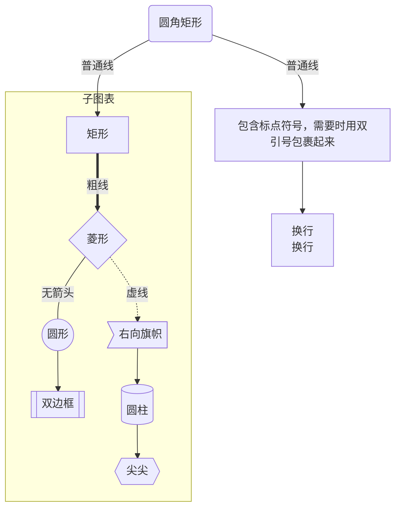
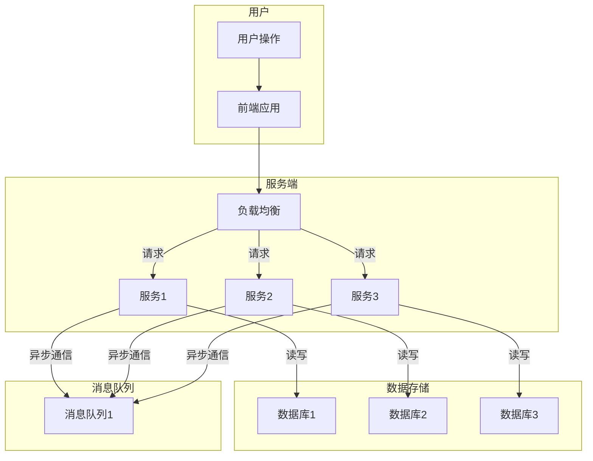

# Github README

**目录**：

- [标题](#标题)


# 标题

```markdown
# 一级标题
## 二级标题
### 三级标题
#### 四级标题
##### 五级标题
###### 六级标题
```

# 字体

## 斜体

- `*斜体*`
- `_斜体_`

## 粗体

- `**粗体**`
- `__粗体__`

## 粗斜体

- `***粗斜体***`
- `___粗斜体___`

## 删除线

`~~文本~~`

## 脚注

`[^脚注]`

```markdown
鲁迅[^1]
[^1]: 原名周树人
```

鲁迅[^1]

[^1]: 原名周树人

# 分割线

三个以上的星号 ( `*` )、减号 ( `-` )、底线 ( `_` )

如：`---`

# 引用

`>` + 空格


# 下划线

使用 HTML 的 `u` 标签


# 换行

- `<br>`
- 上一行文本后补两个空格，实现换行

# 列表

## 有序列表

```markdown
1. 第一项
2. 第二项
3. 第三项
```

## 无序列表

```markdown
* 第一项
* 第二项
* 第三项

+ 第一项
+ 第二项
+ 第三项


- 第一项
- 第二项
- 第三项
```

# 复选框

```markdown
- [x] 已选中
- [ ] 未选中
```

- [x] 已选中
- [ ] 未选中

# 代码

- 反引号
- `code` 标签

```markdown
// 使用一对反引号
`socket`
```

## 代码块

````markdown
```javascript
console.log('Hello');
```
````

# 图片

- ``
- `img` 标签

```markdown

```

`alt` 和 `title` 属性可以省略：

- `alt` ：图片显示失败时替换文本
- `title`：鼠标悬停时显示的文本

仓库中的图片路径：`仓库地址/raw/分支名/图片路径`

# 超链接

- `[链接名称](链接地址)`
- `<链接地址>`

## 锚点

- 大写字母要小写

- 空格使用 `-` 代替

- 多级序号中要去除 `.`

- 特殊字符要省略，如：括号 `()`、<code>`</code>

- 回到顶部 `#`

  ```markdown
  [↑回到顶部](#)
  ```

## 高级链接

通过变量设置链接，实现复用

```markdown
[Google][google]

[google]:wwhttps://www.google.com/
```

# 表格

用 `|` 来分隔不同的单元格，用 `-` 来分隔表头和其他行

```markdown
|  表头   | 表头  |
|  ----  | ----  |
| 单元格  | 单元格 |
| 单元格  | 单元格 |
```

对齐方式：

- `:-`：左对齐
- `-:`：右对齐
- `:-:`：居中对齐

# diff

三个反引号 + `diff`

- `+`：新增
- `-`：删除
- `#`：注释
- `!`：警告

```diff
+ 新增内容
- 删除内容
! 警告
# 注释
```

# HTML

## 折叠

```html
<details>
    <summary>标题</summary>
    内容
</details>
```

## 居中

```html
<div align="center">
    |  表头   | 表头  |
    |  ----  | ----  |
    | 单元格  | 单元格 |
    | 单元格  | 单元格 |
</div>
```

# 高级

## HTML 标签

- `kbd`：键盘
- `b`：加粗
- `i`：斜体
- `em`：斜体
- `sup`：上标
- `sub`：下标
- `br`：换行

## 转义字符

**转义字符**：`\`

- \\：反斜线

- \`：反引号

- \*：星号
- \_：下划线

## 公式

**公式**：

- `$`：行内公式
- `$$`：块级公式

$y=x^2$

## mermaid

### FlowChart

流程图（flow chart）是体现封闭系统运动状态的有效展示形式，可以让管理者、实现者清晰的认识系统运转流程，也可以直观的描述工作过程。

```pseudocode
graph TB
	xxx
```

**图表方向**：`graph` + 方向

| 描述 | 含义     |
| ---- | -------- |
| `TB` | 从上到下 |
| `BT` | 从下到上 |
| `RL` | 从右到左 |
| `LR` | 从做到右 |

**节点**

如果节点名称含标点符号，需要使用双引号

| 描述             | 含义         |
| ---------------- | ------------ |
| `id[节点名称]`   | 矩形节点     |
| `id(节点名称)`   | 圆边矩形节点 |
| `id((节点名称))` | 原形         |
| `id>节点名称]`   | 右向旗帜     |
| `id{节点名称}`   | 菱形节点     |
| `id[[节点名称]]` | 双边框       |
| `id[(节点名称)]` | 圆柱         |
| `id{{节点名称}}` | 两边尖尖     |

**节点连线**

| 表述       | 说明           |
| ---------- | -------------- |
| `>`        | 添加尾部箭头   |
| `-`        | 不添加尾部箭头 |
| `–`        | 单线           |
| `–text–`   | 单线上加文字   |
| `==`       | 粗线           |
| `==text==` | 粗线加文字     |
| `-.-`      | 虚线           |
| `-.text.-` | 虚线加文字     |

**子图表**

```pseudocode
subgraph 子图表名称
	xxx
end
```

```pseudocode
graph TB
    id1(圆角矩形)--普通线-->id2[矩形]
    id1--普通线-->a["包含标点符号，需要时用双引号包裹起来"]
    a-->b[换行<br>换行]
    subgraph 子图表
        id2==粗线==>id3{菱形}
        id3-.虚线.->id4>右向旗帜]
        id3--无箭头---id5((圆形))
        id5-->id6[[双边框]]
        id4-->id7[(圆柱)]
        id7-->id8{{尖尖}}
    end
```




**格式**

```pseudocode
graph LR
    id1(Start)-->id2(Stop)
    style id1 fill:#f9f,stroke:#333,stroke-width:4px
    style id2 fill:#bbf,stroke:#f66,stroke-width:2px,color:#fff,stroke-dasharray: 5 5
```


```pseudocode
graph TD
  subgraph 用户
    用户操作 --> A[前端应用]
  end

  subgraph 服务端
    A --> B[负载均衡]
    B -->|请求| C[服务1]
    B -->|请求| D[服务2]
    B -->|请求| E[服务3]
  end

  subgraph 数据存储
    C -->|读写| F[数据库1]
    D -->|读写| G[数据库2]
    E -->|读写| H[数据库3]
  end

  subgraph 消息队列
    C -->|异步通信| I[消息队列1]
    D -->|异步通信| I
    E -->|异步通信| I
  end
```



#### Sequence Diagram

https://blog.csdn.net/m0_63456808/article/details/138942065


# 徽章

绘制徽章：https://shields.io/

# star 历史

https://star-history.com/

```mark
## Star History

[](https://star-history.com/#YasakaKanoko/coding_note&Date)
```

[](https://star-history.com/#YasakaKanoko/coding_note&Date)